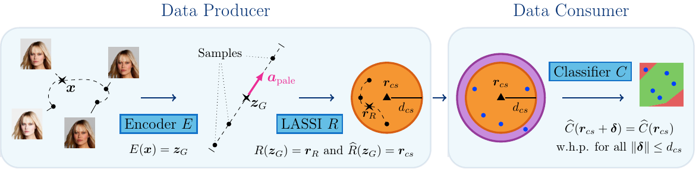

# Latent Space Smoothing for Individually Fair Representations <a href="https://www.sri.inf.ethz.ch/"></a>



LASSI is a state-of-the-art representation learning method for enforcing and certifying the individual fairness of
high-dimensional data, such as images. LASSI defines the set of similar individuals in the latent space of
generative Glow models, which allows us to capture and modify complex continuous semantic attributes
(e.g., hair color).  Next, LASSI employs adversarial learning and center smoothing to learn representations that
provably map similar individuals close to each other. Finally, it uses randomized smoothing to verify local
robustness of downstream applications, resulting in an individual fairness certificate of the end-to-end model.

This repository contains the official implementation of our [ECCV 2022](https://www.sri.inf.ethz.ch/publications/peychev2022latent) paper,
developed at the [SRI Lab, Department of Computer Science, ETH Zurich](https://www.sri.inf.ethz.ch)
as a part of the [Safe AI project](http://safeai.ethz.ch).

## Environment Setup Instructions

Clone this repository:
```bash
$ git clone https://github.com/eth-sri/lassi.git
$ cd lassi
```

Create a conda
(see [Anaconda](https://www.anaconda.com/distribution/#download-section) or
[Miniconda](https://docs.conda.io/en/latest/miniconda.html))
environment with the required packages:
```bash
lassi $ conda env create -f environment.yml
```

Alternatively, we also list the environment dependencies explicitly.
You can create the conda environment and install the packages manually by running the following commands:
```bash
lassi $ conda create --name lassi python=3.8
lassi $ conda activate lassi
(lassi) lassi $ conda install pytorch==1.7.1 torchvision==0.8.2 cudatoolkit=10.2 -c pytorch
(lassi) lassi $ conda install h5py matplotlib notebook pandas python-lmdb scikit-learn statsmodels tensorboard tqdm
(lassi) lassi $ pip install loguru
(lassi) lassi $ conda deactivate
```

Finally, activate the environment and set the `PYTHONPATH`:
```bash
lassi $ source setup.sh
```

## Pretrained Generative Models

Download the pretrained generative Glow models
(together with the released attribute vectors, if you decide to use them):
```bash
(lassi) lassi $ wget http://files.sri.inf.ethz.ch/lassi/saved_models.tar.gz
(lassi) lassi $ sha256sum saved_models.tar.gz
390fe8c8726f80195b5f1f86fb32ee6eeaedac5edf0c2dd8e48c2f09663784ea  saved_models.tar.gz
(lassi) lassi $ tar -xvzf saved_models.tar.gz
```

## Datasets

We run experiments on the following datasets:
* [CelebA](https://mmlab.ie.cuhk.edu.hk/projects/CelebA.html) (download the images in the `img_align_celeba.zip` archive)
* [FairFace](https://github.com/joojs/fairface) (use Padding=0.25)
* [3dshapes](https://github.com/deepmind/3d-shapes)

We provide our custom random data splits of FairFace and 3dshapes, if you would like to use them:
```bash
(lassi) lassi $ wget http://files.sri.inf.ethz.ch/lassi/custom_splits.tar.gz
(lassi) lassi $ sha256sum custom_splits.tar.gz
2e279c3048c3e1e2f6d10fdd36279830b3d5b7f6ba84f2a2e2f43cabd1a68a0f  custom_splits.tar.gz
(lassi) lassi $ tar -xvzf custom_splits.tar.gz
```

Manually download the datasets which you would like to run and extract them in a `data/` folder in the top level
of this repository. In the end, `data/` should have the following structure:

```
lassi
├── data
│   ├── celeba
│   │   ├── img_align_celeba
│   │   │   ├── *.jpg images
│   │   ├── list_attr_celeba.txt
│   │   ├── list_eval_partition.txt
│   │   ├── (The rest of the text files may also be needed...
│   │   └── ... for the PyTorch's CelebA dataset class to work properly)
│   ├── fairface
│   │   ├── train
│   │   │   ├── *.jpg images
│   │   ├── val
│   │   │   ├── *.jpg images
│   │   ├── custom_train_split.txt (optional)
│   │   ├── custom_valid_split.txt (optional)
│   │   ├── fairface_label_train.csv
│   │   └── fairface_label_val.csv
│   ├── 3dshapes
│   │   ├── 3dshapes.h5
│   │   ├── custom_test_split.npy
│   │   ├── custom_train_split.npy
└───└───└── custom_valid_split.npy
```

In order to speed up the training, we cache the image representations in the latent space of the generative models.
We save the cached representations in [LMDB](https://lmdb.readthedocs.io/en/release/) format:
```bash
(lassi) lassi $ cd src/dataset
(lassi) lassi/src/dataset $ ./convert_to_lmdb.sh glow_celeba_64
(lassi) lassi/src/dataset $ ./convert_to_lmdb.sh glow_celeba_128
(lassi) lassi/src/dataset $ ./convert_to_lmdb.sh glow_fairface
(lassi) lassi/src/dataset $ ./convert_to_lmdb.sh glow_3dshapes
```

This will create new versions of the datasets in the `data/` folder:\
`glow_celeba_64_latent_lmdb`,`glow_celeba_128_latent_lmdb`,`glow_fairface_latent_lmdb`, and\
`glow_3dshapes_latent_lmdb`,`glow_3dshapes_latent_lmdb_correlated_orientation`\
respectively.

## Computing the Attribute Vectors

You can recompute the attribute vectors by running the following commands.
Note that due to hardware or library version differences (e.g., different drivers), exact numerical replication
might not be possible.
```bash
(lassi) lassi/src/dataset $ ./compute_attr_vectors_glow.sh celeba64
(lassi) lassi/src/dataset $ ./compute_attr_vectors_glow.sh celeba64 --computation_method perpendicular --epochs 3 --lr 0.001 --normalize_vectors True
(lassi) lassi/src/dataset $ ./compute_attr_vectors_glow.sh celeba64 --computation_method ramaswamy --epochs 3 --lr 0.001 --target Smiling
(lassi) lassi/src/dataset $ ./compute_attr_vectors_glow.sh celeba64_discover
(lassi) lassi/src/dataset $ ./compute_attr_vectors_glow.sh celeba128
(lassi) lassi/src/dataset $ ./compute_attr_vectors_glow.sh fairface
(lassi) lassi/src/dataset $ ./compute_attr_vectors_glow.sh 3dshapes
```

## Reproducing the Experiments

To reproduce the experiments, please run the following scripts.
By default, they run the experiments for 5 random seeds, but you can control this by setting
`--run_only_one_seed True`.
```bash
(lassi) lassi $ cd src/pipelines
(lassi) lassi/src/pipelines $ ./celeba_64_avg_diff.sh > celeba_64_avg_diff.out
(lassi) lassi/src/pipelines $ ./celeba_64_perp.sh > celeba_64_perp.out
(lassi) lassi/src/pipelines $ ./celeba_64_ram.sh > celeba_64_ram.out
(lassi) lassi/src/pipelines $ ./celeba_64_discover.sh > celeba_64_discover.out
(lassi) lassi/src/pipelines $ ./celeba_128_avg_diff.sh > celeba_128_avg_diff.out
(lassi) lassi/src/pipelines $ ./celeba_64_transfer.sh > celeba_64_transfer.out
(lassi) lassi/src/pipelines $ ./fairface_experiments.sh > fairface_experiments.out
(lassi) lassi/src/pipelines $ ./shapes3d_experiments.sh orientation_naive
(lassi) lassi/src/pipelines $ ./shapes3d_experiments.sh orientation_lassi
```

To aggregate the results in a given `.out` file, you can use the `analyse_results.py` script:
```bash
(lassi) lassi/src/pipelines $ python analyse_results.py --out_file [OUT_FILE]
```

## Citing This Work

```
@inproceedings{peychev2022latent,
    title={Latent Space Smoothing for Individually Fair Representations},
    author={Momchil Peychev and Anian Ruoss and Mislav Balunovi{\'{c}} and Maximilian Baader and Martin Vechev},
    booktitle={Computer Vision -- ECCV 2022},
    year={2022},
    pages={535--554},
    organization={Springer}
}
```

## Contributors

* [Momchil Peychev](https://www.sri.inf.ethz.ch/people/momchil) (momchil.peychev@inf.ethz.ch)
* Anian Ruoss (anianr@deepmind.com)
* [Mislav Balunović](https://www.sri.inf.ethz.ch/people/mislav) (mislav.balunovic@inf.ethz.ch)
* [Maximilian Baader](https://www.sri.inf.ethz.ch/people/max) (mbaader@inf.ethz.ch)
* [Martin Vechev](https://www.sri.inf.ethz.ch/people/martin) (martin.vechev@inf.ethz.ch)

## License and Copyright

* Licensed under the [Apache-2.0 License](LICENSE)
* Copyright (c) 2022 [Secure, Reliable, and Intelligent Systems Lab (SRI), ETH Zurich](https://www.sri.inf.ethz.ch)

## Useful Resources

* [glow-pytorch](https://github.com/rosinality/glow-pytorch), `MIT License, Copyright
(c) 2018 Kim Seonghyeon` - used for pretraining the Glow models.
* [center-smoothing](https://github.com/aounon/center-smoothing)
by [Aounon Kumar](https://www.cs.umd.edu/~aounon/) - provides the basis for our center smoothing implementation.
* [smoothing](https://github.com/locuslab/smoothing)
by [Locus Lab](https://github.com/locuslab) - randomized smoothing implementation.
